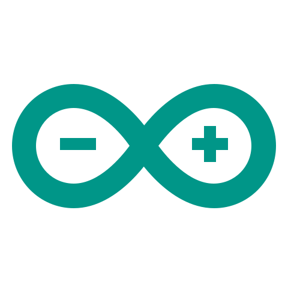
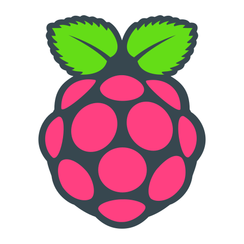

### Hi there 👋

My name is Charlie "Chops" Kingsland and I love programming

---

---
#### Languages & Tools
                                        

---
#### Social Media
<a href="https://www.youtube.com/chops16"><a>    <a href="https://www.twitter.com/chopskingsland"><a>    <a href="https://www.instagram.com/chops.photos"><a>    <a href="https://www.github.com/chopskingsland"><a>    
<!--
**ChopsKingsland/ChopsKingsland** is a ✨ _special_ ✨ repository because its `README.md` (this file) appears on your GitHub profile.

Here are some ideas to get you started:

- 🔭 I’m currently working on ...
- 🌱 I’m currently learning ...
- 👯 I’m looking to collaborate on ...
- 🤔 I’m looking for help with ...
- 💬 Ask me about ...
- 📫 How to reach me: ...
- 😄 Pronouns: ...
- ⚡ Fun fact: ...
-->
